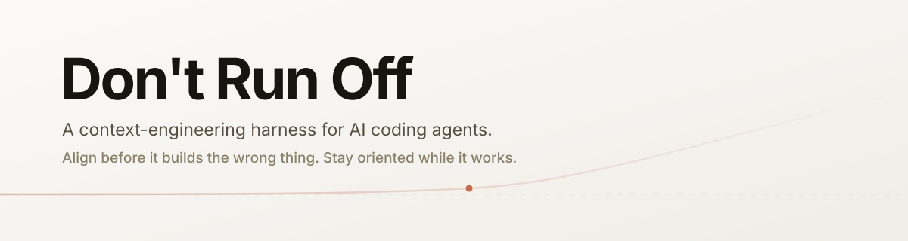
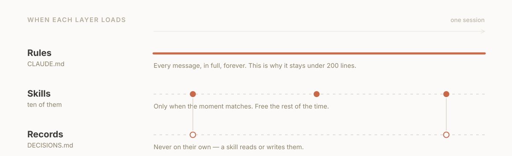
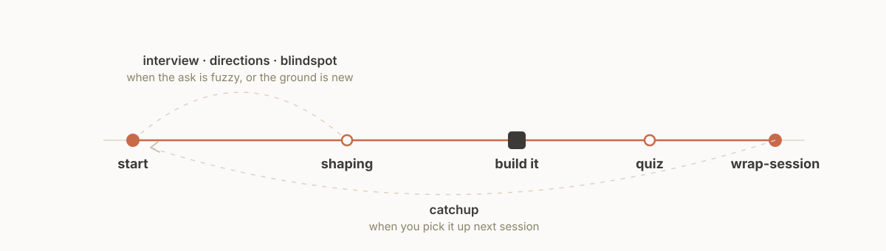

<p align="center">
  <picture>
    <source media="(prefers-color-scheme: dark)" srcset="assets/banner-dark.svg">
    
  </picture>
</p>

<p align="center">
  <a href="#install"></a>
  <a href="#install"></a>
  <a href="LICENSE"></a>
</p>

<p align="center">
  <b>You direct the agent. You ship the result. You don't read every line.</b><br>
  This is the setup that makes that safe.
</p>

<br>

## The thirty seconds before it goes wrong

You ask for something. The agent is confident, fast, and already three files deep in a direction you never wanted. You find out when it's expensive to undo.

That isn't the model being bad. It's the model acting on an **unknown** as if it were known.

<table>
<tr>
<td width="50%" valign="top">

**Your prompt is a map**

What you asked for. Short, clean, and missing most of the detail.

</td>
<td width="50%" valign="top">

**The codebase is the territory**

What's actually there. Messy, specific, full of things you didn't mention.

</td>
</tr>
</table>

The gaps between them are **unknowns**. Every bad outcome starts with an agent walking confidently across one. Catching them is cheap early — a question, a plan, four options with trade-offs — and expensive late.

If you can't audit the diff yourself, that gap is the whole risk. **This harness trades process visibility for code review.**

<br>

## The one rule

> ### Don't run off
>
> Before anything multi-step, ambiguous, unfamiliar, or hard to reverse: **stop and align first.** Propose a short plan, ask what's unclear, get a nod.
>
> For small, clear, low-risk tasks — just do them. Don't ceremony-ize a one-liner.

Everything else here supports that rule or cleans up after it.

<br>

## How it's built

Four layers, separated by **when they load**. That distinction is what most setups get wrong, and getting it wrong is why instructions quietly stop working.

<p align="center">
  <picture>
    <source media="(prefers-color-scheme: dark)" srcset="assets/layers-dark.svg">
    
  </picture>
</p>

<table>
<tr><th align="left" width="22%">Layer</th><th align="left" width="43%">What it is</th><th align="left">When it loads</th></tr>
<tr>
<td valign="top"><b>Rules</b></td>
<td valign="top">The method itself. How the agent behaves before it knows anything about your task.</td>
<td valign="top">Every message, in full, forever. Costs tokens permanently — so it stays under 200 lines.</td>
</tr>
<tr>
<td valign="top"><b>Skills</b></td>
<td valign="top">The moves — orient, interview, shape, quiz, wrap up.</td>
<td valign="top">Only when the moment matches. Free until they fire.</td>
</tr>
<tr>
<td valign="top"><b>Records</b></td>
<td valign="top">Where we are, why we chose this, what's tracked.</td>
<td valign="top">Never automatically. Skills read and write them.</td>
</tr>
<tr>
<td valign="top"><b>Visibility</b></td>
<td valign="top"><code>/context</code>, <code>/doctor</code>, the <code>quiz</code> skill.</td>
<td valign="top">When you want to check the harness is actually working.</td>
</tr>
</table>

### The heuristic that decides where something goes

> **If it must be true before the agent decides anything — it's a rule.**
> **If it's a move you take at a moment — it's a skill.**

*Don't run off* has to be a rule. A skill only loads once something matches its description, and by then the agent has already decided what it's doing. Too late.

*Interview me about this fuzzy task* is a skill. Specific move, specific moment, costs nothing the rest of the time.

<br>

## One file, two halves

Everything always-on lives in a single `CLAUDE.md` — no imports, no stubs, nothing to chase. It has two parts, and the split is the only structural idea you need:

```markdown
<!-- dont-run-off:method — managed, replaced on upgrade -->
# How to work with me
## The one rule: don't run off
## How to talk to me
## Working on code
## Keep me oriented
<!-- /dont-run-off:method -->

## Who you're working with          ← yours, never touched
Altitude · Task tool · Conventions · My frictions
```

The **method** is the rules of engagement — identical for everyone who installs this. Your **profile** is the handful of facts those rules refer to. Neither works alone: the method with no profile is generic advice with no idea who it's talking to; a profile with no method is a bio.

The markers exist so upgrading is surgical. A new version replaces the method block and leaves everything below it exactly as you wrote it.

The same file works per-project: a `./CLAUDE.md` holding this project's facts — stack, commands, gotchas — while the full method stays in your global one. Repeating the method per project just burns the budget twice.

<br>

## The moves

<table>
<tr><th align="left" width="20%">Skill</th><th align="left" width="34%">Use it when</th><th align="left">What you get</th></tr>
<tr><td><code>setup</code></td><td>Installing, or upgrading later</td><td>Your <code>CLAUDE.md</code> written and personalized — detected where it can be, asked where it can't, merged with whatever was already there</td></tr>
<tr><td><code>start</code></td><td>Beginning a session</td><td>Where things stand, what type of session this is, and the right next move — before anything gets built</td></tr>
<tr><td><code>shaping</code></td><td>Deciding whether to build at all</td><td>Frame the real problem, size it, judge if it's worth it, phase it into slices</td></tr>
<tr><td><code>blindspot</code></td><td>Entering territory you don't know</td><td>The things you don't know you don't know, taught plainly</td></tr>
<tr><td><code>interview</code></td><td>Your ask is fuzzy</td><td>One question at a time until the ambiguity is gone, then a short spec</td></tr>
<tr><td><code>directions</code></td><td>You want options</td><td>Four genuinely different approaches with trade-offs, before converging on one</td></tr>
<tr><td><code>quiz</code></td><td>A change just landed</td><td>Plain-language explanation, then questions until you actually understand it</td></tr>
<tr><td><code>catchup</code></td><td>You've lost the thread</td><td>Where we are, what was decided and why, the single next step</td></tr>
<tr><td><code>wrap-session</code></td><td>Stopping for the day</td><td>The record left accurate, so the next session starts instantly</td></tr>
<tr><td><code>taskwarrior</code></td><td>You want local task tracking</td><td>Safe, explicitly-scoped task management across every project in one store</td></tr>
</table>

<br>

## A session, end to end

<p align="center">
  <picture>
    <source media="(prefers-color-scheme: dark)" srcset="assets/session-dark.svg">
    
  </picture>
</p>

<br>

## Install

Two commands, then one conversation. In Claude Code:

```
/plugin marketplace add ronbronstein/dont-run-off
/plugin install dont-run-off@ronbronstein
```

That installs the skills. A plugin can't write your `CLAUDE.md`, so the method arrives the same way everything else here does — by asking first:

```
/dont-run-off:setup
```

It checks what it can see for itself (your task tool, version control, whether record files already exist), asks about the two things it can't — how you want to be talked to, and what usually goes wrong when you work with an agent — and writes the result.

> **Already have a `~/.claude/CLAUDE.md`?** It won't be overwritten. Setup reads it first, backs it up to `CLAUDE.md.bak`, names anything that duplicates the method, and proposes a merge before writing anything. Two sets of instructions saying the same thing differently is how rules start getting quietly ignored — [`docs/architecture.md`](docs/architecture.md) has the debug order if that ever happens.

Finally, run **`/context`** and confirm your `CLAUDE.md` is listed. If it isn't, it didn't load, and nothing else you do matters. An install you haven't verified isn't finished.

### Or one line, without the plugin system

```bash
npx skills add ronbronstein/dont-run-off -g
```

Copies the skills into `~/.claude/skills/` — drop `-g` to install into the current project instead. Then run **`/setup`** (no plugin namespace on this path, so it's `/setup`, not `/dont-run-off:setup`).

The plugin route above is still the one to prefer: it updates itself. This one you update by re-running `npx skills update`.

### Upgrading

```
/plugin update dont-run-off@ronbronstein
/dont-run-off:setup
```

Setup sees the markers, replaces the method block, and leaves your profile exactly as you wrote it.

### Works with

**Claude Code** — that's the target, and the whole harness is built around what it actually loads: `CLAUDE.md` every message, skills only when they fire, `/context` to prove it. The skills themselves follow the [Agent Skills](https://agentskills.io) format and will work anywhere that reads it, but the install path and the visibility commands here are Claude Code's.

<br>

## Make it yours

Everything personal lives below the method block in your `CLAUDE.md`. Setup fills it in for you, and you can edit it freely afterwards — upgrades only ever touch the marked block above it.

```markdown
**Altitude.** Product director — I care about the decision and the
trade-offs, not line-by-line mechanics.

**Conventions.** Python for scripts, plain HTML/JS for small web tools.
Failing test first. Never mutate in place.

**My frictions.** It runs off before I've agreed to anything.
I can't tell what it actually did. I lose the thread between sessions.
```

**Frictions is the line that earns its keep.** Naming what usually goes wrong is what makes the agent watch for it, and it's the field people leave blank. Setup will push you on it.

**Conventions is where your opinions go** — stack, testing bar, house style. Deliberately not in the method: those are true for you, not for everyone, and a shared harness full of one person's preferences is how it stops being usable by anyone else.

Starting a new project? [`templates/`](templates/) has the record files ready to drop in.

<br>

## Contributing

See [CONTRIBUTING.md](CONTRIBUTING.md). Skills must be agnostic, must change what the agent actually does, and must stay small. Arguments for **removing** a skill are as welcome as arguments for adding one.

```bash
npm test    # frontmatter, naming, cross-references, the always-on budget
```

<br>

---

<p align="center">
  <sub>MIT licensed. Built on the map-versus-territory approach to working with AI agents.</sub>
</p>
