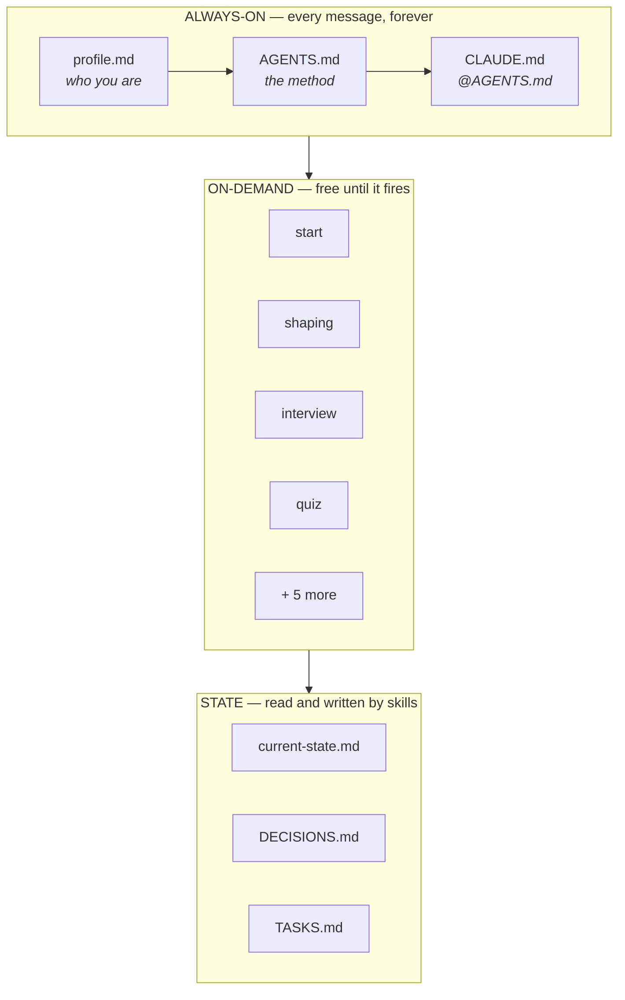
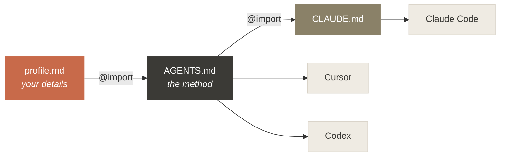
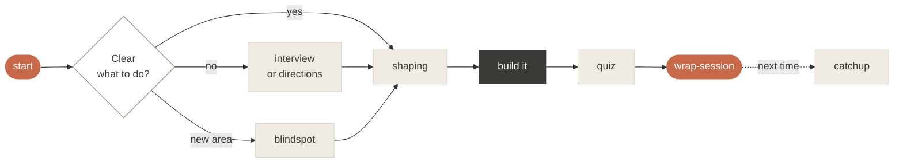

<p align="center">
  <picture>
    <source media="(prefers-color-scheme: dark)" srcset="assets/banner-dark.svg">
    
  </picture>
</p>

<p align="center">
  <a href="#install"></a>
  <a href="#works-with"></a>
  <a href="LICENSE"></a>
</p>

<p align="center">
  <b>You direct the agent. You ship the result. You don't read every line.</b><br>
  This is the setup that makes that safe.
</p>

<br>

## The thirty seconds before it goes wrong

You ask for something. The agent is confident, fast, and already three files deep in a direction you never wanted. You find out when it's expensive to undo.

That isn't the model being bad. It's the model acting on an **unknown** as if it were known.

<table>
<tr>
<td width="50%" valign="top">

**Your prompt is a map**

What you asked for. Short, clean, and missing most of the detail.

</td>
<td width="50%" valign="top">

**The codebase is the territory**

What's actually there. Messy, specific, full of things you didn't mention.

</td>
</tr>
</table>

The gaps between them are **unknowns**. Every bad outcome starts with an agent walking confidently across one. Catching them is cheap early — a question, a plan, four options with trade-offs — and expensive late.

If you can't audit the diff yourself, that gap is the whole risk. **This harness trades process visibility for code review.**

<br>

## The one rule

> ### Don't run off
>
> Before anything multi-step, ambiguous, unfamiliar, or hard to reverse: **stop and align first.** Propose a short plan, ask what's unclear, get a nod.
>
> For small, clear, low-risk tasks — just do them. Don't ceremony-ize a one-liner.

Everything else here supports that rule or cleans up after it.

<br>

## How it's built

Four layers, separated by **when they load**. That distinction is what most setups get wrong, and getting it wrong is why instructions quietly stop working.



<table>
<tr><th align="left" width="22%">Layer</th><th align="left" width="43%">What it is</th><th align="left">When it loads</th></tr>
<tr>
<td valign="top"><b>Rules</b></td>
<td valign="top">The method itself. How the agent behaves before it knows anything about your task.</td>
<td valign="top">Every message, in full, forever. Costs tokens permanently — so it stays under 200 lines.</td>
</tr>
<tr>
<td valign="top"><b>Skills</b></td>
<td valign="top">The moves — orient, interview, shape, quiz, wrap up.</td>
<td valign="top">Only when the moment matches. Free until they fire.</td>
</tr>
<tr>
<td valign="top"><b>Records</b></td>
<td valign="top">Where we are, why we chose this, what's tracked.</td>
<td valign="top">Never automatically. Skills read and write them.</td>
</tr>
<tr>
<td valign="top"><b>Visibility</b></td>
<td valign="top"><code>/context</code>, <code>/doctor</code>, the <code>quiz</code> skill.</td>
<td valign="top">When you want to check the harness is actually working.</td>
</tr>
</table>

### The heuristic that decides where something goes

> **If it must be true before the agent decides anything — it's a rule.**
> **If it's a move you take at a moment — it's a skill.**

*Don't run off* has to be a rule. A skill only loads once something matches its description, and by then the agent has already decided what it's doing. Too late.

*Interview me about this fuzzy task* is a skill. Specific move, specific moment, costs nothing the rest of the time.

<br>

## AGENTS.md and CLAUDE.md — why both

Short version: **Claude Code reads `CLAUDE.md` and does not read `AGENTS.md`.** Cursor, Codex and others read `AGENTS.md`.

Writing your method into both means maintaining two copies, and two copies drift. So the method is written **once** in `AGENTS.md`, and `CLAUDE.md` is a one-line file that imports it:

```markdown
@AGENTS.md
```

That import is expanded at session start, so Claude Code gets the full method while every other agent reads the same source file directly. One copy. Nothing drifts.



The same pattern works per-project: a `./AGENTS.md` with your project's facts, and a `./CLAUDE.md` containing one line.

<br>

## The moves

<table>
<tr><th align="left" width="20%">Skill</th><th align="left" width="34%">Use it when</th><th align="left">What you get</th></tr>
<tr><td><code>start</code></td><td>Beginning a session</td><td>Where things stand, what type of session this is, and the right next move — before anything gets built</td></tr>
<tr><td><code>shaping</code></td><td>Deciding whether to build at all</td><td>Frame the real problem, size it, judge if it's worth it, phase it into slices</td></tr>
<tr><td><code>blindspot</code></td><td>Entering territory you don't know</td><td>The things you don't know you don't know, taught plainly</td></tr>
<tr><td><code>interview</code></td><td>Your ask is fuzzy</td><td>One question at a time until the ambiguity is gone, then a short spec</td></tr>
<tr><td><code>directions</code></td><td>You want options</td><td>Four genuinely different approaches with trade-offs, before converging on one</td></tr>
<tr><td><code>quiz</code></td><td>A change just landed</td><td>Plain-language explanation, then questions until you actually understand it</td></tr>
<tr><td><code>catchup</code></td><td>You've lost the thread</td><td>Where we are, what was decided and why, the single next step</td></tr>
<tr><td><code>wrap-session</code></td><td>Stopping for the day</td><td>The record left accurate, so the next session starts instantly</td></tr>
<tr><td><code>taskwarrior</code></td><td>You want local task tracking</td><td>Safe, explicitly-scoped task management across every project in one store</td></tr>
</table>

<br>

## A session, end to end



<br>

## Install

Coming as a single command. In the meantime the harness is three files and a folder:

```bash
git clone https://github.com/ronbronstein/dont-run-off
cd dont-run-off

cp harness/profile.md ~/.claude/profile.md   # your details — edit this one
cp harness/AGENTS.md  ~/.claude/AGENTS.md    # the method
cp harness/CLAUDE.md  ~/.claude/CLAUDE.md    # imports it
cp -r skills/*        ~/.claude/skills/      # the moves
```

Then open a session and run **`/context`**. If your files aren't listed there, they didn't load, and nothing else you do matters. An install you haven't verified isn't finished.

> **Already have a `~/.claude/CLAUDE.md`?** Don't overwrite it — add `@AGENTS.md` as its first line instead. If your instructions start feeling ignored afterwards, that's contention between sources rather than disobedience; [`docs/architecture.md`](docs/architecture.md) has the debug order.

### Works with

Any agent that reads `AGENTS.md` or supports the [Agent Skills](https://agentskills.io) format — including **Claude Code**, **Cursor**, and **Codex**. Claude Code additionally gets the `CLAUDE.md` import shown above.

<br>

## Make it yours

Everything personal lives in exactly one file: **`~/.claude/profile.md`**. Your altitude, your tools, your record files, and the frictions you want watched for.

```markdown
**Altitude.** Product director — I care about the decision and the
trade-offs, not line-by-line mechanics.

**My frictions.** It runs off before I've agreed to anything.
I can't tell what it actually did. I lose the thread between sessions.
```

Nothing else needs editing, and upgrading never touches it — new versions replace `AGENTS.md` and `skills/` only.

Starting a new project? [`templates/`](templates/) has the record files ready to drop in.

<br>

## Contributing

See [CONTRIBUTING.md](CONTRIBUTING.md). Skills must be agnostic, must change what the agent actually does, and must stay small. Arguments for **removing** a skill are as welcome as arguments for adding one.

```bash
npm test    # frontmatter, naming, cross-references, the always-on budget
```

<br>

---

<p align="center">
  <sub>MIT licensed. Built on the map-versus-territory approach to working with AI agents.</sub>
</p>
